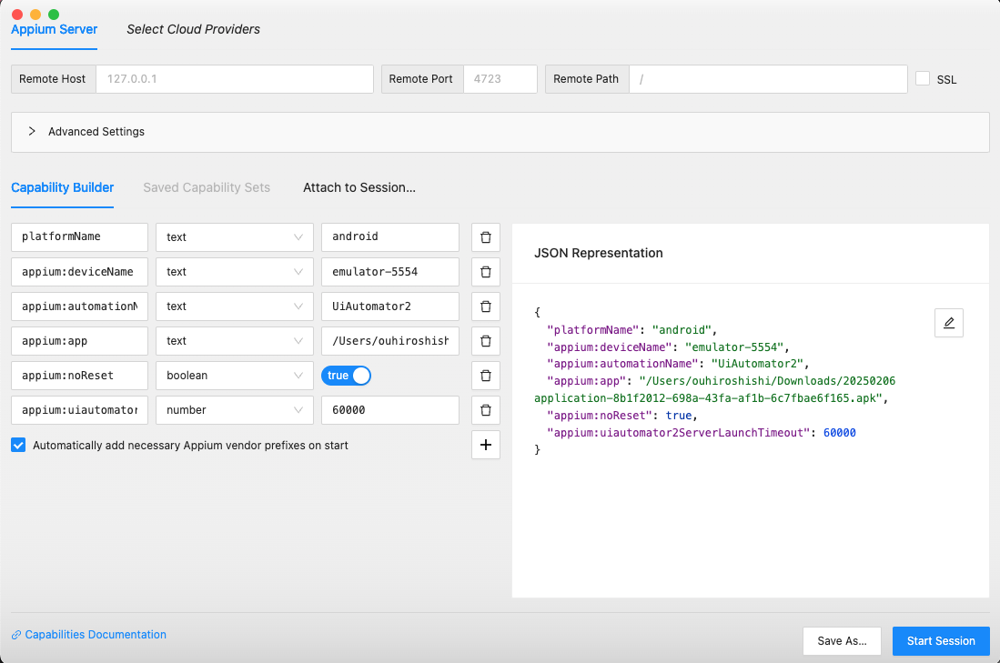

# React Native Appium Testing Framework

This project provides an automated testing framework for React Native applications, supporting both Android and iOS platforms.

## System Requirements

### Required Software

- Xcode 15.4+ (for iOS testing)
- Android Studio Koala 2024.1.1+ (for Android testing)
- Node.js
- Python 3.x
- ffmpeg
  ```bash
  # macOS
  brew install ffmpeg
  # Windows
  choco install ffmpeg
  # Linux
  sudo apt-get install ffmpeg
  ```

### Appium Installation

```bash
# Install Appium
npm install -g appium

# Install platform-specific drivers
# Android
appium driver install uiautomator2
# iOS
appium driver install xcuitest
```

## Environment Setup

### 1. Install Dependencies

```bash
python3 -m pip install -r requirements.txt
```

### 2. Configure .env File

```env
APPIUM_OS="android"  # android or ios
IMPLICIT_WAIT=15
NO_RESET="True"
AUTO_ACCEPT_ALERTS="True"
UDID="4BEC1422-4429-4EAD-B850-C296B013A210"  # Optional, for specific device targeting
```

### 3. WebDriverAgent Setup (iOS Only)

1. Clone [WebDriverAgent](https://github.com/appium/WebDriverAgent)
2. Open WebDriverAgent.xcodeproj in Xcode
3. Select WebDriverAgentRunner and run tests

## Running Tests

### Start Appium Server

```bash
# Local start
appium

```

After starting Appium, you should see something like this:


2. Ensure Docker Compose is installed (included with Docker Desktop for Mac/Windows)

### Build and Run with Docker

```bash
# Build and start containers
docker-compose up --build

# Run in detached mode
docker-compose up -d --build

# Stop containers
docker-compose down
```

### Verify Docker Container

```bash
# Check container status
docker ps

# View container logs
docker-compose logs -f
```

### Execute Test Cases

```bash
# Run all tests and generate Allure report （Primary use）
# It will automatically generate allure report after test execution then send result to slack channel
pytest --alluredir=./allure-results

# Rerun failed tests （Secondary use）
pytest --lf --alluredir=./allure-results --reruns 3
```

### Generate Test Reports

```bash
# Generate static report （Primary use）
allure generate allure-results -o allure-report --clean

# Start report server （Secondary use）
allure serve allure-results
```

## Element Location Tools

### Appium Inspector

- Download: [appium/appium-inspector](https://github.com/appium/appium-inspector)
- Or use web version: [inspector.appiumpro.com](https://inspector.appiumpro.com)
  ```bash
  # Enable CORS for web version
  appium --allow-cors
  ```

#### Steps to Connect Appium Inspector

1. Start Appium server in terminal:

```bash
appium
```

2. In the Desired Capabilities section, input the JSON configuration according to your platform and update the app path to your local app file location:

For Android testing:

```json
{
  "platformName": "android",
  "appium:deviceName": "emulator-5554",
  "appium:automationName": "UiAutomator2",
  "appium:app": "/path/to/your/app.apk",
  "appium:noReset": true,
  "appium:uiautomator2ServerLaunchTimeout": 60000
}
```

For iOS testing:

```json
{
  "platformName": "ios",
  "appium:deviceName": "iPhone 15 Pro",
  "appium:automationName": "XCUITest",
  "appium:platformVersion": "17.5",
  "appium:app": "/path/to/your/Runner.app",
  "appium:noReset": true,
  "appium:autoAcceptAlerts": true
}
```



## Device Configuration

### Finding Device UDID

- For iOS Simulator:
  ```bash
  xcrun simctl list devices
  ```
- For Android:
  ```bash
  adb devices
  ```

## Capabilities Configuration

Update the capabilities in your test setup according to your environment:

```python
# Android Example
options.set_capability('app', '/path/to/your/app.apk')
options.set_capability('deviceName', 'Android Emulator')
options.set_capability('platformVersion', '34.0')

# iOS Example
options.set_capability('app', '/path/to/your/Runner.app')
options.set_capability('deviceName', 'iPhone 15 Pro')
options.set_capability('platformVersion', '17.5')
```

## References & Resources

- [Appium Docker Android](https://github.com/appium/appium-docker-android)
- [Appium UIAutomator2 Driver](https://github.com/appium/appium-uiautomator2-driver)
- [Appium XCUITest Driver](https://github.com/appium/appium-xcuitest-driver)
- [XCUITest Locator Strategies](https://appium.github.io/appium-xcuitest-driver/latest/reference/locator-strategies/)
- [Appium Installation Guide](https://appium.io/docs/en/latest/quickstart/install/)

## Troubleshooting

### Common Issues

1. **WebDriverAgent Installation Failed**

   - Ensure Xcode command line tools are installed
   - Try rebuilding WebDriverAgent in Xcode

2. **Android Device Not Detected**

   - Verify ADB is installed and running
   - Check USB debugging is enabled on the device

3. **Appium Server Connection Issues**
   - Verify correct port configuration
   - Check if the server is running with proper permissions
