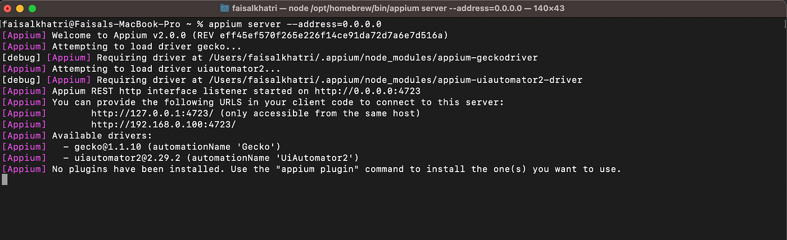
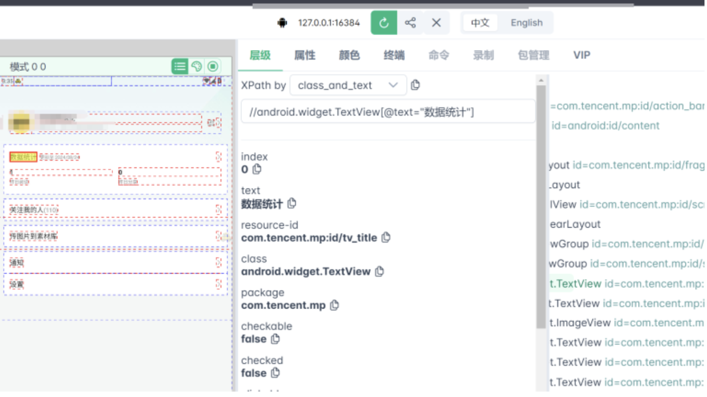

<div align="center">

# 🚀 React Native Appium Testing Framework

A powerful automated testing framework for React Native applications, supporting both Android and iOS platforms.

[]()
[]()
[]()
[]()

</div>

# 📋 Table of Contents

- [🚀 React Native Appium Testing Framework](#-react-native-appium-testing-framework)
- [📋 Table of Contents](#-table-of-contents)
    - [Required Software](#required-software)
    - [Package Installation](#package-installation)
    - [Appium Setup](#appium-setup)
    - [3. WebDriverAgent Setup (iOS Only)](#3-webdriveragent-setup-ios-only)
  - [Running Tests](#running-tests)
    - [Start Appium Server](#start-appium-server)
    - [Prerequisites](#prerequisites)
    - [Build and Run with Docker](#build-and-run-with-docker)
    - [Basic Test Execution](#basic-test-execution)
    - [Report Generation Commands](#report-generation-commands)
    - [Generate Test Reports](#generate-test-reports)
    - [Appium Inspector](#appium-inspector)
      - [Android Configuration](#android-configuration)
      - [iOS {Simulator} Configuration](#ios-simulator-configuration)
      - [iOS {Real Device} Configuration](#ios-real-device-configuration)
    - [Using Appium Inspector](#using-appium-inspector)
    - [uiauto.dev Tool](#uiautodev-tool)
      - [Prerequisites](#prerequisites-1)
      - [Installation](#installation)
      - [Launch Methods](#launch-methods)
      - [Key Features](#key-features)
      - [Configuration Steps](#configuration-steps)
      - [Using uiauto.dev](#using-uiautodev)
    - [Find Device UDID](#find-device-udid)

<h1 id="system-requirements">💻 System Requirements</h1>

### Required Software

| Software       | Version         | Purpose             |
| -------------- | --------------- | ------------------- |
| Xcode          | 15.4+           | iOS Testing         |
| Android Studio | Koala 2024.1.1+ | Android Testing     |
| Node.js        | Latest LTS      | Runtime Environment |
| Python         | 3.x             | Test Scripts        |
| ffmpeg         | Latest          | Video Processing    |

### Package Installation

```bash
# macOS
brew install ffmpeg

# Windows
choco install ffmpeg

# Linux
sudo apt-get install ffmpeg
```

<h1 id="installation-guide">🔧 Installation Guide</h1>

### Appium Setup

```bash
# Install Appium globally
npm install -g appium

# Install platform-specific drivers
appium driver install uiautomator2  # Android
appium driver install xcuitest      # iOS
```

<h1 id="environment-setup">⚙️ Environment Setup</h1>

1. **Install Dependencies**

```bash
python3 -m pip install -r requirements.txt
```

2. **Configure Environment Variables**

```

# .env

```

```
APPIUM_OS="ios" # android or ios
IMPLICIT_WAIT=15
NO_RESET="True"
AUTO_ACCEPT_ALERTS="True"
UDID="4BEC1422-4429-4EAD-B850-C296B013A210" # Optional, for specific device targeting

```

### 3. WebDriverAgent Setup (iOS Only)

1. Clone [WebDriverAgent](https://github.com/appium/WebDriverAgent)
2. Open WebDriverAgent.xcodeproj in Xcode
3. Select WebDriverAgentRunner and run tests

## Running Tests

1. **Platform-Specific Setup**

<details>
<summary>iOS Setup</summary>

1. Clone WebDriverAgent:

```bash
git clone https://github.com/appium/WebDriverAgent
```

2. Open WebDriverAgent.xcodeproj in Xcode
3. Select WebDriverAgentRunner and run tests
</details>

<h1 id="running-tests">🧨 Running Tests</h1>

### Start Appium Server

```bash

# Local start
appium
```

After starting Appium, you should see something like this:



<h1 id="docker-setup-and-execution">🐳 Docker Setup and Execution</h1>

### Prerequisites

1. Install Docker from [Get Docker](https://docs.docker.com/get-docker/)
2. Ensure Docker Compose is installed (included with Docker Desktop for Mac/Windows)

### Build and Run with Docker

```bash
# Build and start containers
docker-compose up --build

# Run in detached mode
docker-compose up -d --build

# Stop containers
docker-compose down
```

```bash
# Check container status
docker ps

# View container logs
docker-compose logs -f
```

<h1 id="test-execution-commands">⌨️ Test Execution Commands</h1>

### Basic Test Execution

```bash
# Run all tests with verbose output
pytest -v

# Run tests with regression marker
pytest -k "regression"

# Run tests by keyword
pytest -k "login_invalid_email"

# Run specific test file
pytest tests/steps/android/test_04create_checkout_steps.py
```

### Report Generation Commands

```bash
# Run tests with Allure report generation (Basic)
pytest --alluredir=./allure-results

# Run all tests including skipped tests with Allure report
pytest -v --alluredir=./allure-results

# Generate and open Allure report
allure serve ./allure-results
```

<h1 id="test-execution-reports">📊 Test Execution & Reports</h1>

```bash
# Run all tests and generate Allure report （Primary use）
# It will automatically generate allure report after test execution then send result to slack channel
pytest --alluredir=./allure-results

# Rerun failed tests （Secondary use）
pytest --lf --alluredir=./allure-results --reruns 3
```

### Generate Test Reports

```bash
# Generate static report （Primary use）
allure generate allure-results -o allure-report --clean

# Start report server （Secondary use）
allure serve allure-results
```

<h1 id="element-location-tools">🔍 Element Location Tools</h1>

### Appium Inspector

- Download Appium Inspector
- Configure Appium Server
- Start Appium Server
- Launch Appium Inspector
- Configure Desired Capabilities

#### Android Configuration

```json
{
  "platformName": "android",
  "appium:deviceName": "emulator-5554",
  "appium:automationName": "UiAutomator2",
  "appium:platformVersion": "13",
  "appium:app": "/path/to/your/android/app-staging-debug.apk",
  "appium:noReset": true,
  "appium:uiautomator2ServerLaunchTimeout": 60000
}
```

#### iOS {Simulator} Configuration

```json
{
  "platformName": "ios",
  "appium:deviceName": "iPhone 15",
  "appium:automationName": "XCUITest",
  "appium:platformVersion": "17.2",
  "appium:app": "/path/to/your/ios/Hotcake.app",
  "appium:noReset": true,
  "appium:autoAcceptAlerts": true
}
```

#### iOS {Real Device} Configuration

```json
{
  "platformName": "ios",
  "appium:deviceName": "iPhone",
  "appium:automationName": "XCUITest",
  "appium:platformVersion": "17.5",
  "appium:udid": "YOUR-PERSONAL-UUID",
  "appium:noReset": true,
  "appium:autoAcceptAlerts": true
}
```

### Using Appium Inspector

<div align="center">
  
</div>

### uiauto.dev Tool

[uiauto.dev](https://uiauto.dev/) is a powerful web-based tool for inspecting mobile app elements. It provides a more user-friendly interface compared to Appium Inspector and supports both Android and iOS platforms.

#### Prerequisites

- Python 3.8 or higher
- Appium server running locally

#### Installation

```bash
# Install uiauto.dev
pip3 install -U uiautodev
```

#### Launch Methods

```bash
# Method 1: Direct command
uiauto.dev

# Method 2: Python module
python3 -m uiautodev
```

#### Key Features

- Web-based interface (no installation required)
- Real-time element inspection
- Support for both Android and iOS
- Element hierarchy visualization
- XPath and accessibility ID generation
- Screenshot capture and element highlighting

#### Configuration Steps

1. Start your Appium server
2. Connect your device or emulator
3. Configure the desired capabilities

#### Using uiauto.dev

1. Enter your Appium server URL (default: http://localhost:4723)
2. Configure the desired capabilities
3. Click "Start Session"
4. Use the interface to:
   - Inspect elements
   - Generate locators
   - Take screenshots
   - View element hierarchy

<div align="center">
  
</div>

<h1 id="device-configuration">📱 Device Configuration</h1>

### Find Device UDID

```bash
# iOS Simulator
xcrun simctl list devices

# Android
adb devices
```

<h1 id="references">📚 References</h1>

- [Appium Documentation](https://appium.io/docs/en/latest/)
- [UIAutomator2 Driver](https://github.com/appium/appium-uiautomator2-driver)
- [XCUITest Driver](https://github.com/appium/appium-xcuitest-driver)
- [Docker Setup Guide](https://github.com/appium/appium-docker-android)

<h1 id="troubleshooting">❗ Troubleshooting</h1>

<details>
<summary>WebDriverAgent Installation Failed</summary>

1. Check the following:

- Verify Xcode command line tools installation
- Rebuild WebDriverAgent in Xcode
- Check signing certificates
</details>

<details>
<summary>Android Device Not Detected</summary>

1. Check the following:

- Verify ADB installation
- Enable USB debugging
- Check USB connection
</details>

<details>
<summary>Appium Server Connection Issues</summary>

1. Check the following:

- Verify port configuration
- Check server permissions
- Review server logs
</details>

---
