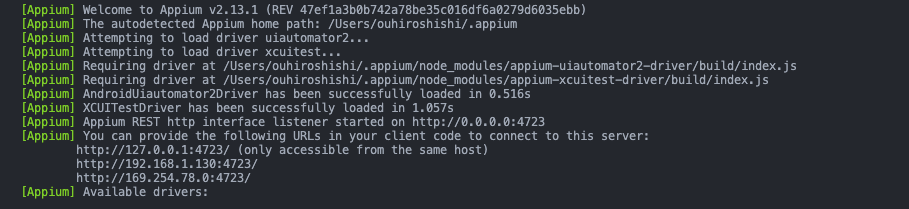

<div align="center">

# 🚀 React Native Appium Testing Framework

A powerful automated testing framework for React Native applications, supporting both Android and iOS platforms.

[]()
[]()
[]()
[]()

</div>

# 📋 Table of Contents

- [System Requirements](#system-requirements)
- [Installation Guide](#installation-guide)
- [Environment Setup](#environment-setup)
- [Running Tests](#running-tests)
- [Docker Setup and Execution](#docker-setup-and-execution)
- [Test Execution & Reports](#test-execution-reports)
- [Element Location Tools](#element-location-tools)
- [Troubleshooting](#troubleshooting)

<h1 id="system-requirements">💻 System Requirements</h1>

### Required Software

| Software       | Version         | Purpose             |
| -------------- | --------------- | ------------------- |
| Xcode          | 15.4+           | iOS Testing         |
| Android Studio | Koala 2024.1.1+ | Android Testing     |
| Node.js        | Latest LTS      | Runtime Environment |
| Python         | 3.x             | Test Scripts        |
| ffmpeg         | Latest          | Video Processing    |

### Package Installation

```bash
# macOS
brew install ffmpeg

# Windows
choco install ffmpeg

# Linux
sudo apt-get install ffmpeg
```

<h1 id="installation-guide">🔧 Installation Guide</h1>

### Appium Setup

```bash
# Install Appium globally
npm install -g appium

# Install platform-specific drivers
appium driver install uiautomator2  # Android
appium driver install xcuitest      # iOS
```

<h1 id="environment-setup">⚙️ Environment Setup</h1>

1. **Install Dependencies**

```bash
python3 -m pip install -r requirements.txt
```

2. **Configure Environment Variables**

```

# .env

```

```
APPIUM_OS="ios" # android or ios
IMPLICIT_WAIT=15
NO_RESET="True"
AUTO_ACCEPT_ALERTS="True"
UDID="4BEC1422-4429-4EAD-B850-C296B013A210" # Optional, for specific device targeting

```

### 3. WebDriverAgent Setup (iOS Only)

1. Clone [WebDriverAgent](https://github.com/appium/WebDriverAgent)
2. Open WebDriverAgent.xcodeproj in Xcode
3. Select WebDriverAgentRunner and run tests

## Running Tests

1. **Platform-Specific Setup**

<details>
<summary>iOS Setup</summary>

1. Clone WebDriverAgent:

```bash
git clone https://github.com/appium/WebDriverAgent
```

2. Open WebDriverAgent.xcodeproj in Xcode
3. Select WebDriverAgentRunner and run tests
</details>

<h1 id="running-tests">🧨 Running Tests</h1>

### Start Appium Server

```bash

# Local start
appium
```

After starting Appium, you should see something like this:



<h1 id="docker-setup">🐳 Docker Setup and Execution</h1>

### Prerequisites

1. Install Docker from [Get Docker](https://docs.docker.com/get-docker/)
2. Ensure Docker Compose is installed (included with Docker Desktop for Mac/Windows)

### Build and Run with Docker

```bash
# Build and start containers
docker-compose up --build

# Run in detached mode
docker-compose up -d --build

# Stop containers
docker-compose down
```

```bash
# Check container status
docker ps

# View container logs
docker-compose logs -f
```

<h1 id="test-execution-reports">📊 Test Execution & Reports</h1>

```bash
# Run all tests and generate Allure report （Primary use）
# It will automatically generate allure report after test execution then send result to slack channel
pytest --alluredir=./allure-results

# Rerun failed tests （Secondary use）
pytest --lf --alluredir=./allure-results --reruns 3
```

### Generate Test Reports

```bash
# Generate static report （Primary use）
allure generate allure-results -o allure-report --clean

# Start report server （Secondary use）
allure serve allure-results
```

<h1 id="element-location-tools">🔍 Element Location Tools</h1>

### Appium Inspector Configuration

> ⚠️ **Important**: You must first start the Appium server in your terminal (by running the `appium` command) before you can use Appium Inspector for element inspection.

<div align="center">
  
</div>

<details>
<summary>Android Capabilities</summary>

```json
{
  "platformName": "android",
  "appium:deviceName": "emulator-5554",
  "appium:automationName": "UiAutomator2",
  "appium:app": "/path/to/your/app.apk",
  "appium:noReset": true,
  "appium:uiautomator2ServerLaunchTimeout": 60000
}
```

</details>

<details>
<summary>iOS Capabilities</summary>

```json
{
  "platformName": "ios",
  "appium:deviceName": "iPhone 15 Pro",
  "appium:automationName": "XCUITest",
  "appium:platformVersion": "17.5",
  "appium:app": "/path/to/your/Runner.app",
  "appium:noReset": true,
  "appium:autoAcceptAlerts": true
}
```

</details>

<h1 id="device-configuration">📱 Device Configuration</h1>

### Find Device UDID

```bash
# iOS Simulator
xcrun simctl list devices

# Android
adb devices
```

<h1 id="references">📚 References</h1>

- [Appium Documentation](https://appium.io/docs/en/latest/)
- [UIAutomator2 Driver](https://github.com/appium/appium-uiautomator2-driver)
- [XCUITest Driver](https://github.com/appium/appium-xcuitest-driver)
- [Docker Setup Guide](https://github.com/appium/appium-docker-android)

<h1 id="troubleshooting">❗ Troubleshooting</h1>

<details>
<summary>WebDriverAgent Installation Failed</summary>

1. Check the following:

- Verify Xcode command line tools installation
- Rebuild WebDriverAgent in Xcode
- Check signing certificates
</details>

<details>
<summary>Android Device Not Detected</summary>

1. Check the following:

- Verify ADB installation
- Enable USB debugging
- Check USB connection
</details>

<details>
<summary>Appium Server Connection Issues</summary>

1. Check the following:

- Verify port configuration
- Check server permissions
- Review server logs
</details>

---
